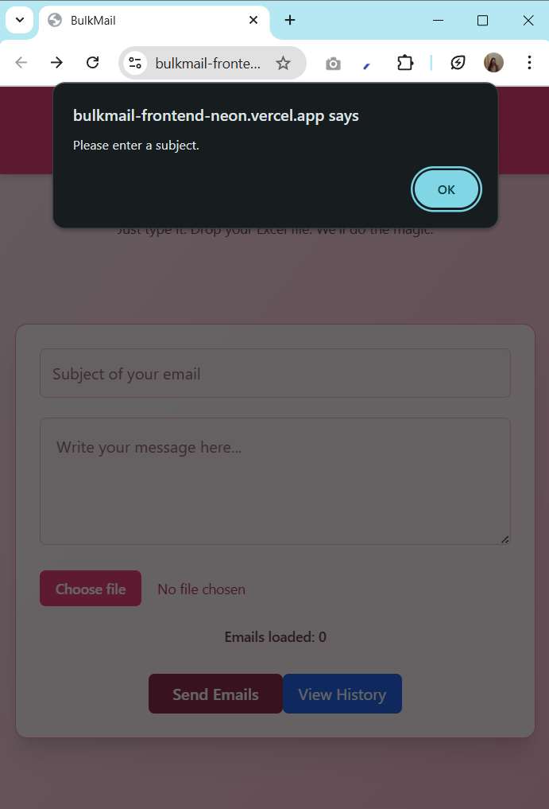
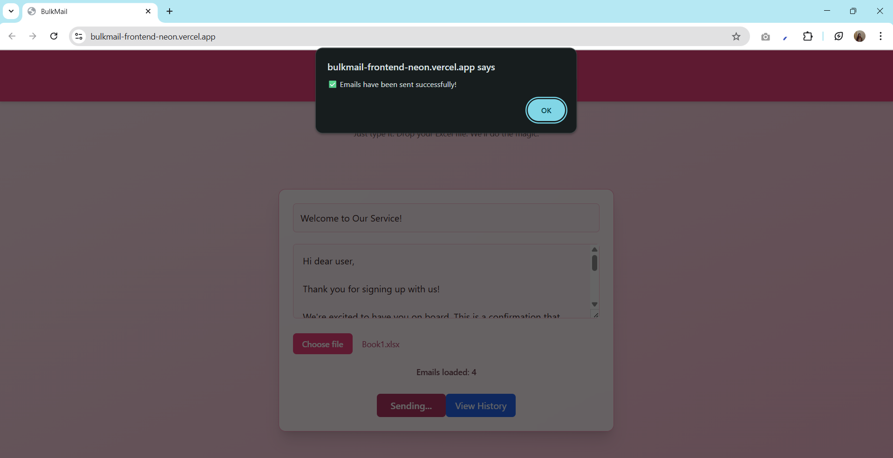

#  BulkMail – Email Blaster App

BulkMail is a lightweight bulk email sender app built using **React.js**, **Node.js**, **Express**, **MongoDB**, and **Nodemailer**. It allows users to send personalized emails to multiple recipients from an uploaded Excel file.

---

##  Features

-  Send emails to a list of recipients via Excel file
-  Upload `.xlsx` files (email list)
-  Compose subject & message directly
-  Tracks sent status
-  View history of sent emails
-  Delete individual records from history

---

## 🌐 Deployment Links

- 🔗 **Frontend**: [https://bulkmail-frontend-neon.vercel.app](https://bulkmail-frontend-neon.vercel.app)  
- 🔗 **Backend**: [https://bulkmail-backend-pq5l.onrender.com](https://bulkmail-backend-pq5l.onrender.com)

---

##  Folder Structure

```
BulkMail/
├── backend/                      # Node.js + Express API
│   ├── index.js                  # Main backend server file
│   ├── models/
│   │   └── EmailRecord.js        # Mongoose model for email history
│   └── package.json
│
├── frontend/                     # React frontend app
│   ├── src/
│   │   ├── MainApp.jsx           # Main email sending UI
│   │   ├── History.jsx           # Email history page
│   │   └── App.jsx
│   └── package.json
│
├── screenshots/
│   ├── send-mail-page.png       # Screenshot of Main UI
│   └── history-page.png         # Screenshot of history page
│
└── README.md                     # Project documentation
```

---

##  Getting Started

###  Backend Setup

```bash
cd backend
npm install
node index.js
```

> Make sure your MongoDB connection string and Gmail app password are set correctly.

###  Frontend Setup

```bash
cd frontend
npm install
npm start
```

---

##  Screenshots

###  Send Mail Page


###  History Page


###  Input Error Page


### success Page


### Warning Page


###  Deleted Page

---

##  Backend GitHub Repo

> GitHub: [https://github.com/Manjushree8/bulkmail-backend](https://github.com/Manjushree8/bulkmail-backend)

---

##  Contact

**Manjushree Venkatesan**  
 manjushree0228@gmail.com  
 [GitHub](https://github.com/Manjushree8)  
 [LinkedIn](https://www.linkedin.com/in/manjushree-venkatesan-b2b86826b)

---

##  License

This project is for educational/demo purposes. Feel free to fork and customize it.